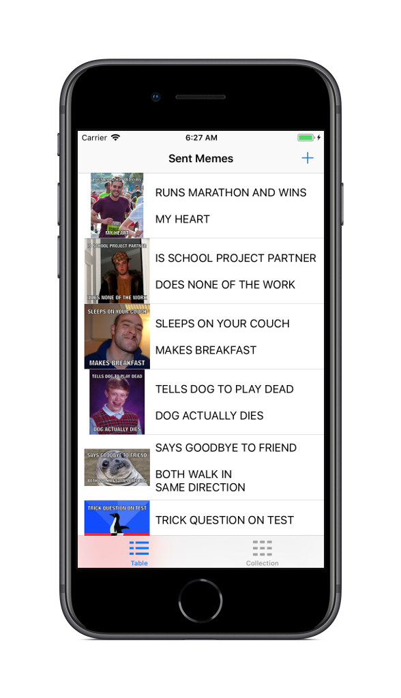
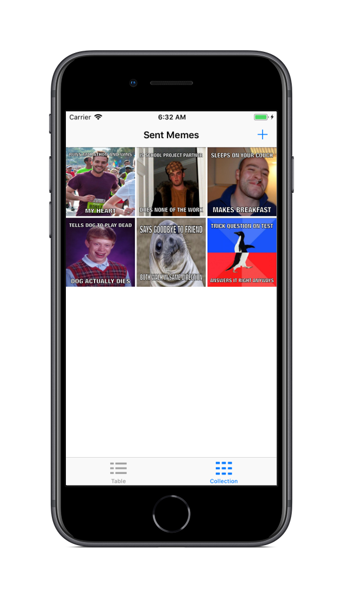
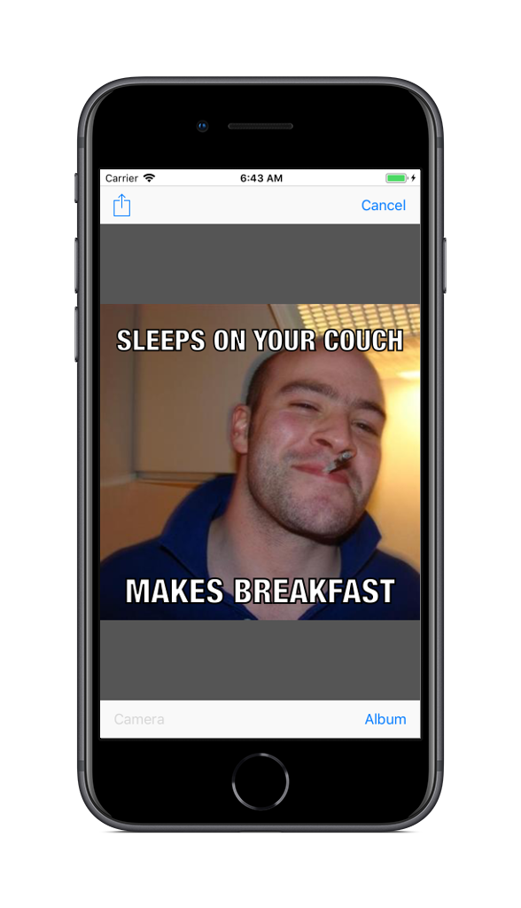

# Meme Me

## Introduction
**Meme Me** is an iOS app that allows you to take a picture from your camera or library and overlay text on it to make a meme.

## Usage
* Make a meme very easily with a photo in your library or your camera.
* View memes you have already made in a table view or a collection view.

## Screenshots
 

